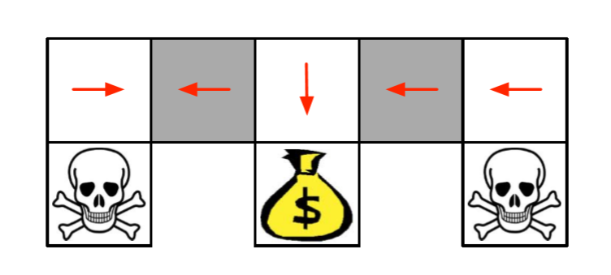
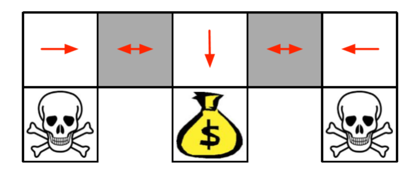
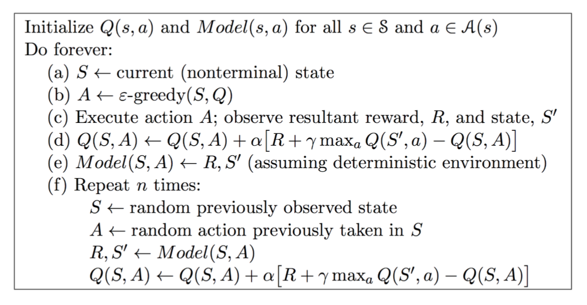

### Lectur e 1: Introduction to Reinforcement Learning  [[slides](./intro_RL.pdf)]

1. agent state, enviroment state, information state

   information state (Markov state) 包含历史中所有有用的信息
   $$
   \mathbb{P}[S_{t+1} | S_t] = \mathbb{P}[S_{t+1} | S_1,...,S_t]
   $$
   “The future is independent of the past given the present” 

   简而言之，未来与现在的过去状态无关

2. Major Components: Policy, Value function and Model
3. Value Based, Policy Based, Actor Critic ,Model Free and Model Based
4. Exploration and Exploitation

### Lecture 2: Markov Decision Process

1. Markov Process

   马尔可夫过程可以定义为一个元组($S,P​$)

   $S$ 为有限的状态集

   $P$ 为状态转移矩阵
   $$
   P_{ss'} = \mathbb{P}[S_{t+1} = s' | S_t = s]
   $$

2. Markov Reward Process

   马尔可夫奖励过程可以定义为一个元组($S,P,{\color{red}R, \gamma}​$)

   $S ​$ 为有限的状态集

   $P​$ 为状态转移矩阵

$$
P_{ss'} = \mathbb{P}[S_{t+1} = s' | S_t = s]
$$

​	   **${\color{red}R \;为奖励函数，R_s = \mathbb{E}[R_{t+1}\;|\;S_t=s]}​$**，可以理解为在状态t可获得的下一个状态的奖励

​	   $\color{red}{\gamma\;为衰减因子,\gamma \in [0,1]}​$

​	   定义$G_t​$，为随着次数变化的奖励衰减和
$$
G_t=r_t+γr_{t+1}+γ^2r_{t+2}+γ^3r_{t+3}+\cdots=\sum\limits_{k=0}^{\infty}\gamma^kR_{t+k+1}
$$
​	   紧接着，我们定义Value Function，$v(s)$ 表示在状态s的 $G_t​$
$$
v(s) = \mathbb{E}[G_t | S_t = s]
$$
​	   接着，推导出Bellman平衡(为递归定义)：

​	$v(s) = \mathbb{E}[G_t | S_t = s]$

​		$= \mathbb{E}[R_{t+1} + γR_{t+2} + γ^2R_{t+3} + \cdots| S_t = s]​$

​		$= \mathbb{E}[R_{t+1} + γ(R_{t+2} + γR_{t+3} + \cdots)| S_t = s]$

​		$= \mathbb{E}[R_{t+1} + γG_{t+1}| S_t = s]​$

​		$= \mathbb{E}[R_{t+1} + γv(S_{t+1})| S_t = s]$

​	$R$ 从t+1开始是因为，需要和环境交互之后才会得到一个reward

​	更为简便的，我们使用矩阵来计算和表示：
$$
v = R +\gamma Pv
$$

$$
\begin{equation}
\left[
    \begin{matrix}
    v(1)\\
    \vdots\\
    v(n)
    \end{matrix}
\right]
=
\left[
    \begin{matrix}
    R_1\\
    \vdots\\
    R_n
    \end{matrix}
\right]
+\gamma
\left[
    \begin{matrix}
    P_{11} & \cdots & P_{1n}\\
 	\vdots & \ddots & \vdots\\
 	P_{n1} & \cdots & P_{nn}
    \end{matrix}
\right]
\left[
    \begin{matrix}
    v(1)\\
    \vdots\\
    v(n)
    \end{matrix}
\right]
\end{equation}
$$
​	接着我们再做一个简单的转换吧：
$$
\qquad\qquad\qquad \;\;\ v = R+\gamma Pv\\
(1-\gamma P)v = R\\
\qquad\qquad\qquad\quad\quad \;\; v = (1-\gamma P)^{-1}R
$$
​	

3. Markov Decision Process

   马尔可夫决策过程是马尔可夫奖励过程+决策：

   马尔可夫决策过程可以表示为一个元组$(S,{\color{red}A},P,R,\gamma)​$

   $S ​$ 为有限的状态集

   ${\color{red}A \;为有限的动作集}​$

   $P​$ 为状态转移矩阵
   $$
   P_{ss'}^{\color{red}a} = \mathbb{P}[S_{t+1} = s' | S_t = {\color{red}a}]
   $$
    $R$ 为奖励函数*，$R_s^{\color{red}a} = \mathbb{E}[R_{t+1}\;|\;S_t=s,A_t={\color{red}a}]$*

    $\gamma$ 为衰减因子，$\gamma \in [0,1]$

4. Polices

   策略$\pi$，是一个从状态到动作的分布，只取决于当前状态
   $$
   \pi(a|s)=\mathbb{P}[A_t=a\;|\;S_t=s]
   $$

5. Bellman Expectation Equation(动态规划算法)

   为了引出贝尔曼平衡讲了很多其他的概念，但简单点理解吧，贴上一个简单点的公式
   $$
   v_\pi=R^\pi+\gamma P^\pi v_\pi
   $$

6. 找到一个 Optimal Policy

   对于每一个MDP，都存在一个确定的最佳的 Policy

   如果我们知道了$q_*(s,a)$ ，我们就能马上知道optimal policy
   $$
   f(n)=
   \begin{cases}
   1\quad if\;a={argmax\\a \in A}\;q_*(s,a) \\
   0\quad otherwise
   \end{cases}
   $$
   

## Lecture 3: Planning by Dynamic Programming

1. 如何提升一个Policy

    1）Evaluate一个Policy $\pi$ ，
   $$
   V_\pi(s)=\mathbb{E}[R_{t+1}+\gamma R_{t+2}+\dots|S_t=s]
   $$
    2）使用 $v_\pi​$ 贪婪的更新这个Policy
   $$
   \pi'=greedy(v_\pi)
   $$
   

    3）具体更新迭代步骤，进行单步更新操作。具体意思为：当前动作的最大的q，需要大于或等于当前所能采取的任意动作所获得的q
   $$
   \pi' (s)={argmax \\a\in A}\;q_\pi (s,a)\\
   \qquad\qquad\quad\ \ q_\pi (s,\pi' (s)) = {max \\a\in A} q_\pi (s,a) ≥ q_\pi (s,π(s)) = v_\pi (s)
   $$
    4）稳定之后

$$
q_\pi (s,\pi' (s)) = {max \\a\in A} q_\pi (s,a) = q_\pi (s,π(s)) = v_\pi (s)
$$

2. 如何提升一个Value function

   1）更新迭代
   $$
   v_∗(s) \leftarrow {max\\ a\in A} R^a_s + \gamma \;\sum_{s'\in S}
   P^a_{ss'}v_∗(s')
   $$
   2）中间步骤无法代表任何一个policy

## Lecture 4: Model-Free Prediction

1. Monte-Carlo 策略更新(不知道奖励值和转移矩阵)

   目标：使用策略$\pi $，在经验中学习$v_\pi $
   $$
   S_1，A_1,R_2,\dots,S_k \sim \pi
   $$
   返回值是被折算后的奖励的总值：
   $$
   G_t = R_{t+1} + \gamma R_{t+2} + \dots + \gamma^{T−1}R_T
   $$
   value function 是期望的返回值
   $$
   v_\pi(s) = \mathbb{E}_\pi [G_t \; |\; S_t = s] 
   $$
   Monte-Carlo策略评估使用经验值，而不是期望返回值

2. Every/First-Visit Monte-Carlo Policy Evaluation(以一个episode 为单位，即done了之后为一个episode)

   (first在某个episode状态s出现了两次，我们计算时仅使用第一个。every表示两次都用)(更新操作为当一个episode完了之后获得总的$G_t $ 再更新)

   To evaluate state s

   $\color{red}Every/first​$ time-step t that state s is visited in an episode, 

   Increment counter $N(s) \leftarrow N(s) + 1 $

   Increment total return $S(s) \leftarrow S(s) + G_t ​$

   Value is estimated by mean return $V(s) = S(s)/N(s) ​$

   Again, $V(s) \to v_\pi(s)\; as\; N(s) \to \infty$

3. 计算均值时，使用总的回报除以状态s的访问次数，将一般的均值求取变为增量式均值求取的过程
   $$
   \mu_k = \frac{1}{k}\sum^k_{j=1}x_j\\
   \qquad\qquad\ \ \ =\frac{1}{k}\bigg(x_k +\sum_{j=1}^{k-1}x_j \bigg)\\
   \qquad\qquad\qquad \ \ =\frac{1}{k}(x_k +(k-1)\mu_{k-1})\\
   \qquad\qquad\qquad\ \ \ =\mu_{k-1}+\frac{1}{k}(x_k-\mu_{k-1})
   $$

4. 于是将上边的推导使用到这(对于每一个state)

$$
N(S_t) \leftarrow N(S_t) + 1 \\ 
V(S_t) \leftarrow V(S_t) +\frac{1}{N(S_t)}(G_t −V(S_t))
$$

​	  但也可以用确定值$\alpha$代替
$$
V(S_t) \leftarrow V(S_t) +\alpha(G_t −V(S_t))
$$

5. TD,学习时不使用完整的episodes,此处展示的为TD(0)
   $$
   V(S_t) \leftarrow V(S_t) + \alpha ({\color{red}{R_{t+1} + \gamma V(S_{t+1})}}−V(S_t))
   $$
   $R_{t+1} + \gamma V(S_{t+1}) $ 为TD target

   $\delta_t = R_{t+1} + \gamma V(S_{t+1}) -V(S_t)$ 为 TD error

6. 对TD和MC做了大量比较(总结为：单步和多步的区别)，TD(n)相当于MC
7.  讲到使用TD($\lambda ​$)进行更新

## Lecture 5: Model Free Control

1. On-policy learning：学习来自自己当前的$ \pi ​$ 所 sample的经历

   Off-policy learning：学习来自$ \mu ​$ 已有的经历

2. 迭代更新(贪婪策略),第一个公式使用MDP模型，第二个公式使用$Q(s,a)$,进行更加直观的表示
   $$
   \qquad\quad\;\pi'(s) = {argmax \\a\in A}\ R^a_s +P^a_{ss'}V(s')\\
   \pi'(s) = {argmax \\a\in A}\ Q(s,a)
   $$

3. $\epsilon​$ -Greedy Policy Improvement：1-$\epsilon ​$，的概率选择贪婪的动作，$ \epsilon ​$ 的概率选择随机的动作

4. Greedy in the Limit with Infinite Exploration(GLIE)

   1）确保所有的state-action都有探索到${\;\; \lim \\ \small\small{ k \to \infty }}\; N_k(s,a) = \infty$

   2）最后要收敛到一个贪婪的policy

5. 比较MC和TD之后，选择使用TD，使用法则：

   1）将TD应用到Q(S,A)

   2）使用$ \epsilon $-greedy 来提升policy

   3）单步更新

   4）提出新的算法Sarsa(on-policy)

   ​      **其中，Q的更新都为 $\epsilon​$ -greedy**
   $$
   Q(S,A) \leftarrow Q(S,A) + \alpha\underbrace{(R + \gamma Q(S',A')−Q(S,A))}_{TD \;error}
   $$

6. n-Step Sarsa
   $$
   \qquad\qquad\qquad\qquad q^{(n)}_t = R_{t+1} + \gamma R_{t+2} + \ldots  + \gamma^{n−1}R_{t+n} + \gamma ^nQ(S_{t+n}) \\
   Q(S_t,A_t) \leftarrow Q(S_t,A_t) + \alpha\bigg (q^{(n)}_t −Q(S_t,A_t)\bigg)
   $$

7. 由此引出 Sarsa($\lambda​$)：将在某个state进行的1-step,2-step ... n-step所获得的$q^{(n)}_t​$ 分别乘上一个衰减的折扣值，公式呈上，主要目的为对行为的价值进行评估：
   $$
   q_t^\lambda =(1-\lambda)\sum^\infty_{n=1}\lambda^{n-1}q_t^{(n)}\\
   $$
   将Q 改写成：
   $$
   Q(S_t,A_t) \leftarrow Q(S_t,A_t) + \alpha\big(q^λ_t −Q(S_t,A_t)\big)
   $$
   和Sarsa相比，更新时能对整个有效的动作链的Value进行更新

8. off-policy

   典型代表为TD(0)，即Q-Learning(使用了两个policy)
   $$
   Q(S_t,A_t) \leftarrow Q(S_t,A_t) + \alpha({\color{red}{R_{t+1} + \gamma Q(S_{t+1},A')}}−Q(S_t,A_t))
   $$
   

   target policy $\pi $ ,$\color{red}greedy$  w.r.t Q(s,a):
   $$
   \pi (S_{t+1}) = {argmax\\\quad \small a'}\;Q(S_{t+1},a')
   $$
   Q-target可表示为:
   $$
   R_{t+1} + \gamma Q(S_{t+1},A')\\
   \qquad\qquad\qquad=R_{t+1} + \gamma Q(S_{t+1},{argmax \\ \quad\;\small a'}\;Q(S_{t+1},a'))\\
   \ \;=R_{t+1} + {max \\ \;\; \small a'}\;\gamma Q(S_{t+1},a')
   $$
   然而,behaviour policy $\mu$，$\color{red}\epsilon-greedy$ w.r.t Q(s,a)，意思为按概率进行贪心选择

## Lecture 6: Value Function Approximation

1. 选择 differentiable(可微分的) function approximators

   例如：Linear combinations of features & Neural network

2. 线性价值函数近似,value function
   $$
   \hat{v}(s,{\bf {w}}) \approx v_\pi(s)\\
   or \;\hat{q}(s,a,{\bf {w}}) \approx q_\pi(s,a)
   $$

   用一个特征向量表示一个状态(目的是使其可微)
$$
   x(S) =
   \left(
       \begin{matrix}
       x_1(S)\\
       \vdots\\
       x_n(S)
       \end{matrix}
   \right)
$$

   使用特征的线性组合来代表value function，其中w为参数
$$
   \hat{v}(S,{\bf{w}}) = {\bf{x}}(S)^T{\bf{w}} =\sum^n_{j=1}{\bf{x}}_j(S){\bf{w}}_j
$$
   目标函数为：
$$
   J({\bf{w}}) = \mathbb{E}_\pi\big[(v_\pi(S)−{\bf{x}}(S)^T{\bf{w}})^2\big]
$$
   在线性价值函数近似下，MC,TD(0),TD(λ)更新时所采用的target

   对于MC,目标值是$G_t$
$$
   \Delta w = \alpha({\color{red}G_t}-\hat{v}(S_t,{\bf{w}}))\nabla_w \hat{v}(S_t,{\bf{w}})
$$
   对于TD(0)，目标值是TD target $R_{t+1} + \gamma V(S_{t+1})$
$$
\Delta w = \alpha ({\color{red}{R_{t+1} + \gamma \hat{v}(S_{t+1}，w)}}-\hat{v}(S_t,{\bf{w}}))\nabla_w \hat{v}(S_t,{\bf{w}})
$$
   对于TD(λ)，目标值是$G_t^\lambda​$
$$
\;\Delta w = \alpha({\color{red}G_t^\lambda}-\hat{v}(S_t,{\bf{w}}))\nabla_w \hat{v}(S_t,{\bf{w}})\\
   =\alpha({\color{red}G_t^\lambda}-\hat{v}(S_t,{\bf{w}}))\times(S_t)
$$

3. 线性 Action-Value 函数的近似 

   用一个特征向量表示一个状态(目的是使其可微)
   $$
   x(S) =
   \left(
       \begin{matrix}
       x_1(S,A)\\
       \vdots\\
       x_n(S,A)
       \end{matrix}
   \right)
   $$
   

   使用特征的线性组合来代表action-value function，其中w为参数
   $$
   \hat{q}(S,A,{\bf{w}}) = {\bf{x}}(S,A)^T{\bf{w}} =\sum^n_{j=1}{\bf{x}}_j(S,A){\bf{w}}_j
   $$
   目标函数为：
   $$
   J({\bf{w}}) = \mathbb{E}_\pi\big[(q_\pi(S,A)-\hat{q}(S,A,\bf{w}))^2\big]
   $$
   对于TD(0)，目标值是TD target $R_{t+1} + \gamma Q(S_{t+1},A_{t+1})$
   $$
   \Delta w = \alpha ({\color{red}{R_{t+1} + \gamma \hat{q}(S_{t+1}，A_{t+1},w)}}-\hat{q}(S_t,A_t,{\bf{w}}))\nabla_w \hat{q}(S_t,A_t,{\bf{w}})
   $$
   对于MC、TD(λ)也类似

4. 批量强化学习

   记忆储存与回放

   DQN

## Lecture 7: Policy Gradient Methods

1. 对policy进行参数化
   $$
   \pi_\theta(s,a)=\mathbb{P}[a\;|\;s,\theta]\
   $$

2. policy的优缺点

   优点：更好的收敛性

   ​	   在高维和连续的动作空间更有效

   ​	   能学到随机的 policies

   缺点：很容易收敛到局部最优而不是全局最优

   ​	   无法对一个policy做出准确的评估(低效的&高方差)

3. optimal deterministic policy&stochastic policy

   最优的确定性policy : Value-based RL 会学到近似确定性policy

   

   最优的随机policy:在某个state会有多少概率采取某个action

   

4. Monte-Carlo Policy Gradient

   目标函数为($\alpha$ 为步长)：
   $$
   \Delta\theta=\alpha\nabla_\theta J(\theta)=\alpha
   \left(
   	\begin{matrix}
   	\frac{\partial J(\theta)}{\partial \theta_1}\\
   	\vdots\\
   	\frac{\partial J(\theta)}{\partial \theta_n}\\
   	\end{matrix}
   \right)
   $$
   由此梯度定义为$\nabla_\theta\pi_\theta(s,a)​$：
   $$
   \nabla_\theta\pi_\theta(s,a)=\pi_\theta(s,a)\frac{\nabla_\theta\pi_\theta(s,a)}{\pi_\theta(s,a)}\\
   \qquad\qquad\quad\; =\pi_\theta(s,a)\underbrace{\nabla_\theta log\pi_\theta(s,a)}_{score \;function}
   $$
   Softmax Policy:
   $$
   \pi_\theta(s,a) \propto e^{\phi(s,a)^T\theta }
   $$
   ​	score function:
   $$
   \nabla_\theta log\pi_\theta(s,a)=\phi(s,a)-\mathbb{E}_{\pi\theta}[\phi(s,·)]
   $$
   Gaussian Policy:
   $$
   a \sim \mathcal{N}(\mu(s),\sigma^2)
   $$
   ​	score function:
   $$
   \nabla_\theta log\pi_\theta(s,a)=\frac{(a-\mu(s))\phi(s)}{\sigma^2}
   $$
   Policy Gradient:
   $$
   \nabla_\theta J(\theta)=\mathbb{E}_{\pi_\theta}[\underbrace{\nabla_\theta log\pi_\theta(s,a)}_{score\;function}\underbrace{Q^{\pi_\theta(s,a)}}_{long-term\\\;\;\;value}]
   $$
   使用$v_t$这个unbiased sample代替 $Q^{\pi_\theta}(s_t,a_t)$, $\Delta\theta_t$可以表示为：
   $$
   \Delta\theta_t=\alpha\nabla_\theta log\pi_\theta(s_t,a_t)v_t
   $$
   更新函数：
   $$
   \theta \leftarrow \theta+\alpha\Delta\theta_t\\
   \qquad\qquad\qquad\leftarrow \theta+\alpha\nabla_\theta log\pi_\theta(s_t,a_t)v_t
   $$

5. Actor-critic

   Actor :更新policy的 $\theta$ 参数，被critic直接指导

   Critic :更新action-value函数的参数w

   使用baseline来降低方差：

   ​	用advantage function($A^{\pi_\theta}(s,a)$)来重写policy gradient
   $$
   A^{\pi_\theta}(s,a)=\overbrace{Q^{\pi_\theta}(s,a)-V^{\pi_\theta}(s)}^{在s采取动作a是否可行}\\
   \qquad\quad\;\ \;\nabla_\theta J(\theta)=\mathbb{E}[\nabla_{\pi_\theta}log\pi_\theta(s,a){\color{red}{A^{\pi_\theta}(s,a)}}]
   $$
   ​	确保$V^{\pi_\theta}(s)$和$Q^{\pi_\theta}(s,a)$ 的准确性，使用两个函数的approximators和两个参数的向量来估计(和前边的差不多)：
   $$
   \; V_v(s) \approx V^{\pi_\theta}(s)\\
   Q_w(s,a) \approx Q^{\pi_\theta}(s,a)\\
   \qquad\qquad A(s,a) = Q_w(s,a)-V_v(s)
   $$

   ​	TD error $\delta^{\pi_\theta}$ 是 advantage function的无偏估计
$$
   \qquad\qquad\;\delta^{\pi_\theta}=r+\gamma V^{\pi_\theta}(s')-V^{\pi_\theta}(s)\\
   \;\\
   \qquad\;\;\mathbb{E}_{\pi_\theta}[\delta^{\pi_\theta}|s,a]=\mathbb{E}_{\pi_\theta}[r+\gamma V^{\pi_\theta}(s')|s,a]-V^{\pi_\theta}(s)\\
   \qquad\qquad=Q^{\pi_\theta}(s,a)-V^{\pi_\theta}(s)\\
   =A^{\pi_\theta}(s,a)\\
$$
   ​	所以可以使用TD error来计算policy gradient
$$
   \nabla_\theta J(\theta)=\mathbb{E}[\nabla_{\pi_\theta}log\pi_\theta(s,a){\color{red}\delta^\pi_\theta}]
$$
   ​	将TD error简化,这将只需要 critic 的参数 v
$$
   \delta_v = r+\gamma V_v(s')-V_v(s)
$$

## Lecture 8: Integrating Learning and Planning

1. Model-Baesd Reinforcement Learning

   model $\mathcal{M}=\left \langle \mathcal{P}_\eta,\mathcal{R}_\eta \right \rangle$ 来代表状态的转化
   $$
   S_{t+1} \sim P_\eta(S_{t+1} | S_t,A_t) \\
   R_{t+1} = R_\eta(R_{t+1} | S_t,A_t) 
   $$
   简单理解：通过已知的数据来进行学习，也就是你知道了state和reward的转化。这其实就是一个监督学习的问题

2. Table Lookup Model

3. 经历来源：

   真实经历：对环境进行采样(true MDP)

   模拟经历：对模型进行采样(approximate MDP)

4. Dyna-Q Algorithm，用到了model-based来plan和Q-Learning来learn

   

   5.Simulation-Based Search

   ​	进行forward search 操作

   6.简单的蒙特卡洛搜索

   ​	先sample出在某个state所采取的action，然后通过验证后，选择一个值最高的action
   $$
   Monte-Carlo\;evaluation:Q({\color{red}{s_t,a}})=\frac{1}{K}\sum^{K}_{k=1}G_t \rightarrow q_\pi(s_t,a)\\
   \qquad\qquad\;\; maximum\;value\;:a_t={argmax\\a \in \mathcal{A}}\;Q(s_t,a)
   $$
   7.TD Search：对于每次的simulation,使用Sarsa来更新action-values

## Lecture 9: Exploration and Exploitation

1. 定义

   Exploration:获取更多的信息

   Exploitation:在当前的信息下做出最佳的决定

   有三种方式可以达到exploration的目的，第一种就是类似ϵ−ϵ−greedy算法在一定概率基础下随机选择一些action，第二种是更加倾向选择更加具有不确定性的状态/动作，这种方法就需要一种方法来衡量这种不确定性，第三种就是收集一些状态信息来确定是否值得到达这个状态(by chenrudan)

2. Regret

   action-value是动作a的reward的均值
   $$
   Q(a)=\mathbb{E}[r|a]
   $$
   optimal value 定义为 $V^*​$:
   $$
   V^*=Q(a^*)={max\\a\in A}Q(a)
   $$
   regret定义为对于一个动作的opportunity loss:
   $$
   I_t=\mathbb{E}[V^*-Q(a_t)]
   $$
   总的regret为opportunity loss 的总和：
   $$
   L_t=\mathbb{E}\bigg[\sum^t_{\tau=1}V^*-Q(a_\tau)\bigg]
   $$
   定义$N_t(a)$ 为action a 被选择的次数，定义 gap $\Delta_a=V^*-Q(a)$

   regret变成了可用次数和gap表示的函数：
   $$
   \quad L_t=\mathbb{E}\bigg[\sum^t_{\tau=1}V^*-Q(a_\tau)\bigg]\\
   \qquad\qquad\;\;=\sum_{a\in A}\mathbb{E}[N_t(a)](V^*-Q(a_t))\\
   \;l=\sum_{a\in A}\mathbb{E}[N_t(a)]\Delta_a
   $$

公式解释：

$\mathbb{E}$ : expected value(期望值)