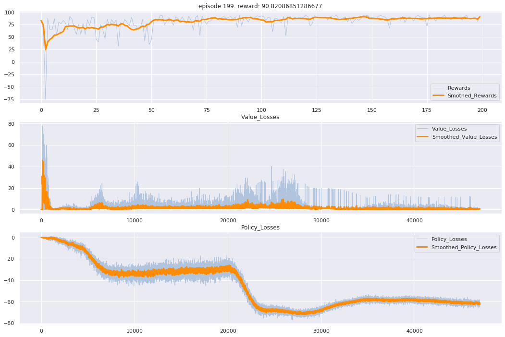
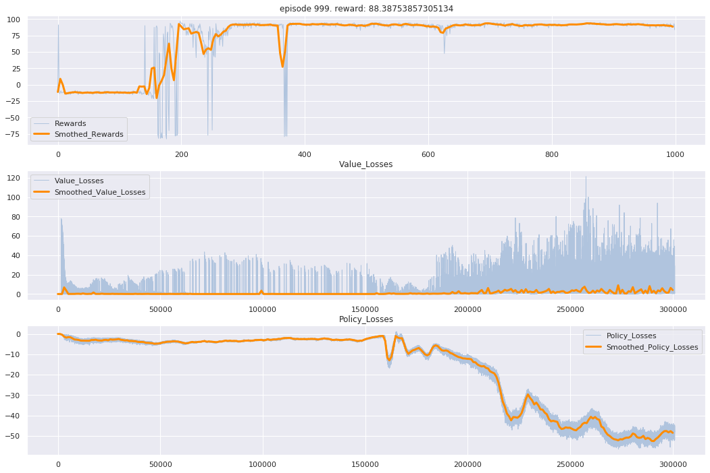
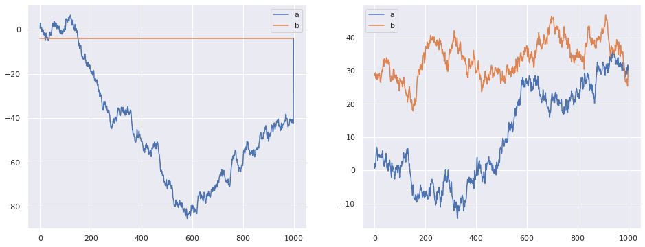
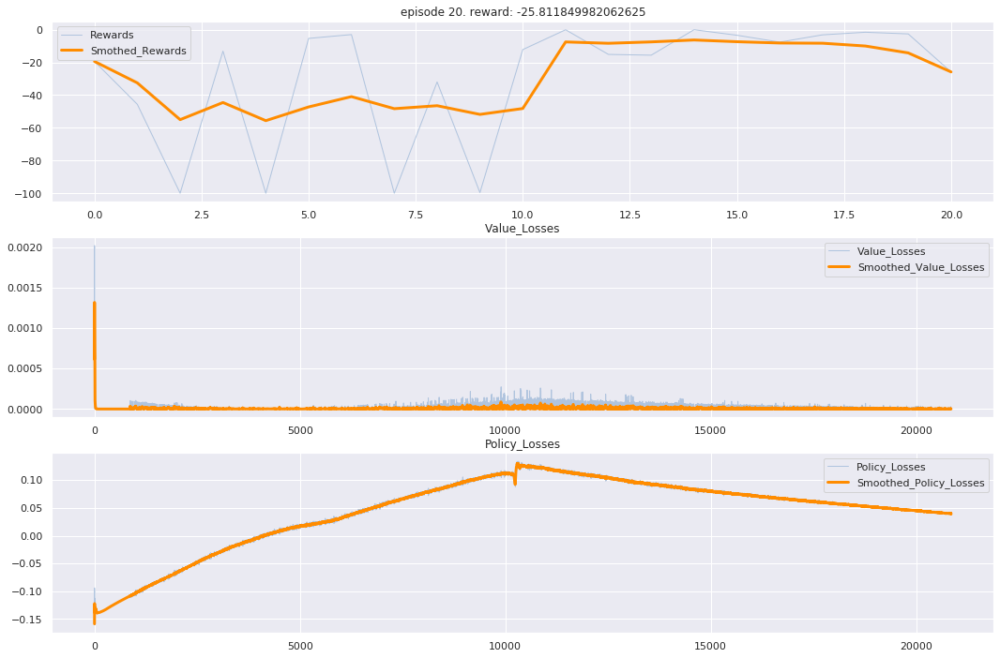
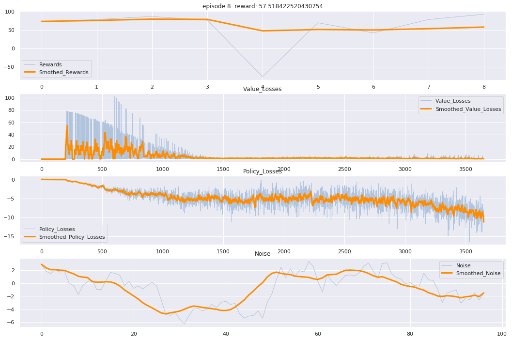
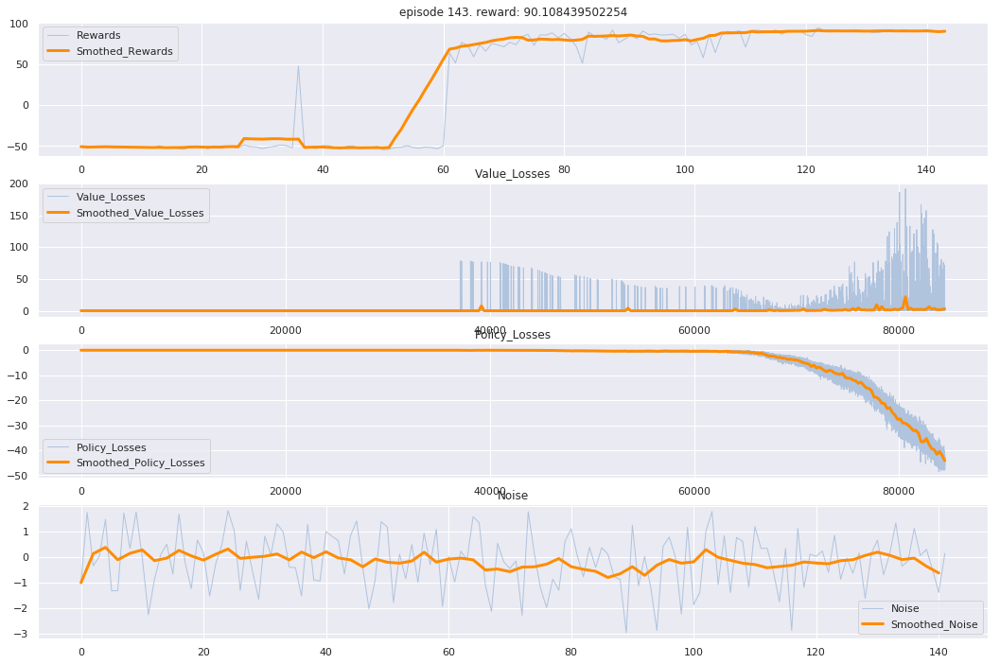
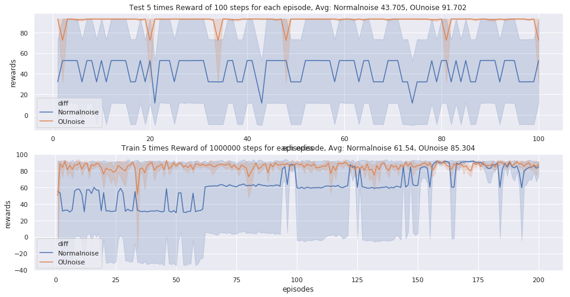
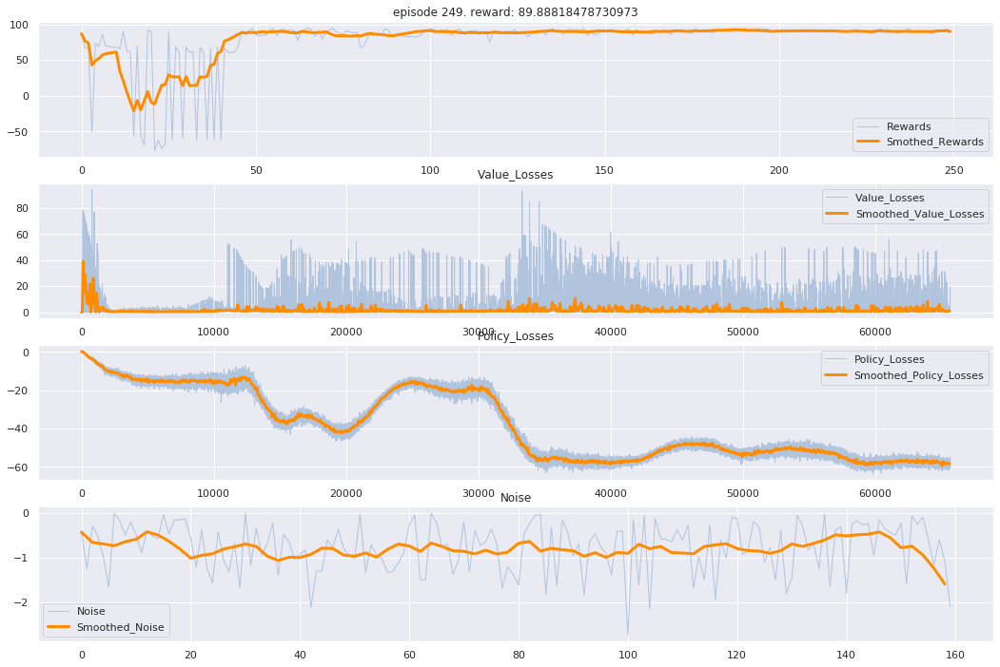

## 方向向量噪声

1. 问题：```Pendulum-v0``` 环境收敛非常慢，```MountainCarContinuous-v0``` 环境学习非常快

   在debug的过程中，发现自己写的**对action添加噪声**的操作有问题。

   

   ```Algorithm ``` : ```DDPG(确定性策略)```

   ```Environment``` : ```MountainCarContinuous-v0(连续动作控制，spare reward)```

* 我的代码 :

```python
class OUNoise:
    def __init__(self, action_space, mu=0.0, theta=0.15, max_sigma=0.3, min_sigma=0.3, decay_period=100000):
        self.mu = mu
        self.theta = theta
        self.sigma = max_sigma
        self.max_sigma = max_sigma
        self.min_sigma = min_sigma
        self.decay_period = decay_period
        self.action_dim = action_space.shape[0]
        self.low = action_space.low
        self.high = action_space.high
        # get 定义立即执行函数
        self.reset()
    
    def reset(self):
        self.state = np.ones(self.action_dim) * self.mu
    
    def evolve_state(self):
        # self.state += [0.0] + 0.3 * np.random.randn(1)
        self.state += self.theta * (self.mu - \			                                         			  	self.state)+np.random.randn(self.action_dim) 
        				# *np.sqrt(0.01) * self.sigma
        return self.state
    
    def get_action(self, action, t=0):
        # self.sigma = self.max_sigma
        self.sigma = self.max_sigma - (self.max_sigma \
                      - self.min_sigma) * min(1.0, t / self.decay_period)
        return np.clip(action + self.evolve_state(), self.low, self.high)
```



* (可能)正确的代码 :

```python
class OUNoise:
    def __init__(self, action_space, mu=0.0, theta=0.15, max_sigma=0.3, min_sigma=0.1, decay_period=100000):
        self.mu = mu
        self.theta = theta
        self.sigma = max_sigma
        self.max_sigma = max_sigma
        self.min_sigma = min_sigma
        self.decay_period = decay_period
        self.action_dim = action_space.shape[0]
        self.low = action_space.low
        self.high = action_space.high
        # get 定义立即执行函数
        self.reset()
    
    def reset(self):
        self.state = np.ones(self.action_dim) * self.mu
    
    def evolve_state(self):
        # self.state += [0.0] + 0.3 * np.random.randn(1)
        self.state = self.state + self.theta * (self.mu - self.state)+ \
                        np.random.randn(self.action_dim) *np.sqrt(0.3) * self.sigma
        return self.state
    
    def get_action(self, action, t=0):
        # self.sigma = self.max_sigma
        self.sigma = self.max_sigma - (self.max_sigma \
                      - self.min_sigma) * min(1.0, t / self.decay_period)
        return np.clip(action + self.evolve_state(), self.low, self.high)
```



​	**收敛更快，可以有效地学习**

* 不同之处：

```python
class OUNoise:
    def evolve_state(self):
		self.state = self.state + xxx
        
class OUNoise:
    def evolve_state(self):
		self.state += xxx
```

2. Experiment 1

* Test 1

```python
class Test:
    def __init__(self):
        self.state = np.zeros(1)
    
    def sample_right(self):
        self.state = self.state + np.random.randn(1)
        return self.state
    
    def sample_error(self):
        self.state += np.random.randn(1)
        return self.state

plt.figure(figsize=(16, 6))

# 左 图
plt.subplot(121)
test = Test()
right_sample = [test.sample_right() for _ in range(1000)]
error_sample = [test.sample_error() for _ in range(1000)]

plt.plot(right_sample, label="a")
plt.plot(error_sample, label="b")
plt.legend()

# 右 图
plt.subplot(122)
test1 = Test()
right_sample = [test1.sample_right()[0] for _ in range(1000)]
error_sample = [test1.sample_error()[0] for _ in range(1000)]

plt.plot(right_sample, label="a")
plt.plot(error_sample, label="b")
plt.legend()

plt.show()
```

* Distinguish

```python
right_sample = [test.sample_right() for _ in range(1000)]
error_sample = [test.sample_error() for _ in range(1000)]

right_sample = [test1.sample_right()[0] for _ in range(1000)]
error_sample = [test1.sample_error()[0] for _ in range(1000)]
```

* Plot



3. 猜测

   在一个episode当中，所产生的噪声为一个确定值。也就是说，每个action都加上一个确定值。而这个确定值的噪声相当于作用在动作方向的一个向量。让小车在动作维度(一维)获得单个方向的力，帮助小车更快获得奖励。

4. Experiment 2

* 每个episode使用不变的噪声变量

```python
for episode in range(episodes):
	noise = np.random.rand(1)
    for step in range(steps):
        action = xxx
        action = action + noise
        env.step(action)
```



​	发现并不是每回合不变的噪声，每回合的噪声都在distrubution，但维持一个短期的噪声向量

* 可视化噪声向量

  存在方向噪声向量：



​	普通高斯噪声：

```python
for episode in range(episodes):
	for step in range(steps):
        action1 = policy_net.get_action(state)
        noise = np.random.randn(1)
        noises.append(noise)
        action = action1 + noise
```



​	**噪声向量确实比单纯的高斯噪声有着更好的结果**

4. 结论

   * 噪声向量维持了一个短暂的方向推力，让agent在某种巧合之下借助推力达成目标，获取奖励值。
* 在奖励值稀疏的环境下，刚训练时。由于nn还没有收敛，agent在高斯噪声中会漂浮不定，无法采样到TD error较高的路径，学习速率较慢。相反，在向量噪声下，不管nn有没有收敛，agent都会获得一个方向推力，让他更有自信，相信自己的所作所为，更容易采样到TD error高的路径，学习速率较快。
   * 在类中调用方法+=和=...+...没有区别，类外调用才有区别。所以其实方向向量一直存在，只是我调参时，噪声幅度出现有不同而已...。

5. 结语

   结束了，这是[Ornstein–Uhlenbeck process](https://en.wikipedia.org/wiki/Ornstein–Uhlenbeck_process)。简单来说，就是在一个高斯过程，马尔科夫过程暂时均匀过程中生成噪声。再见~~~

6. Paper Reading

   - 主要的噪声方式：ε-greedy, OU noise, parameter noise,  novelty search from evolution strategies, "rollout" in many different horizon lengths, efficiently coordinate exploration 

7. 继续吧

   * 测试1：

     ​	两种噪声的生成方式分别进行5次训练和5次测试，绘图如下

     测试结果：

     ​	方向向量噪声：收敛速度更快，Average reward 较高，学习效果更好
     
     ​	高斯噪声：收敛速度较慢，Average reward较低，学习效果较差
     
     
   
   * 测试2：
   
     ​	进行噪声的大小和持续时间的测试，测试代码：
   
     ```python
     test = True
     if step % 200 == 0:
     	test = not test
     noise = abs(np.random.randn(1)) if test else -abs(np.random.randn(1))
     ```
   
     测试结果：
   
     ​	每200个step改变一次噪声的方向，能比较好的收敛
   
     
   
     问题：依然无法获知何时需要噪声，需要多大的噪声，需要什么方向的噪声
   
     idea：1. pre-trained 获知需要噪声的方向，大小，持续时间的信息
   
     ​			2. 训练噪声sample的nn，来观察噪声生成的规律

