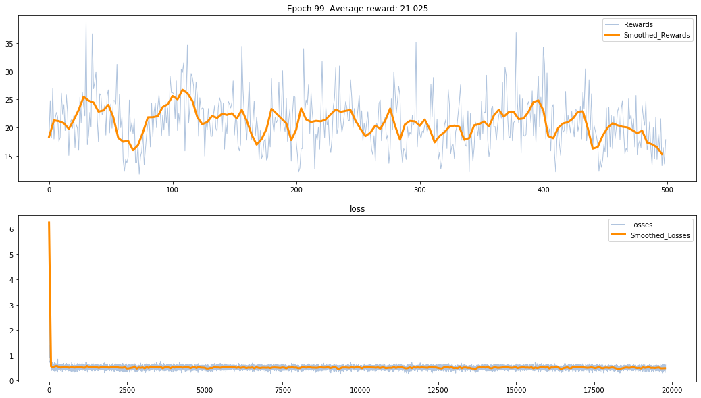
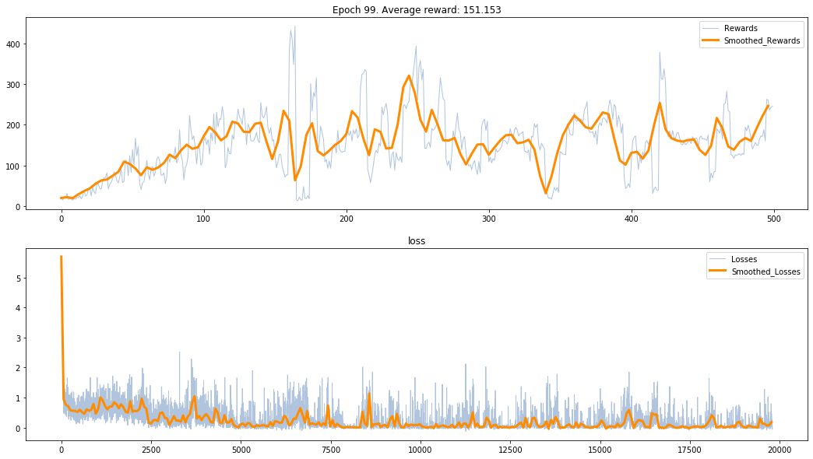
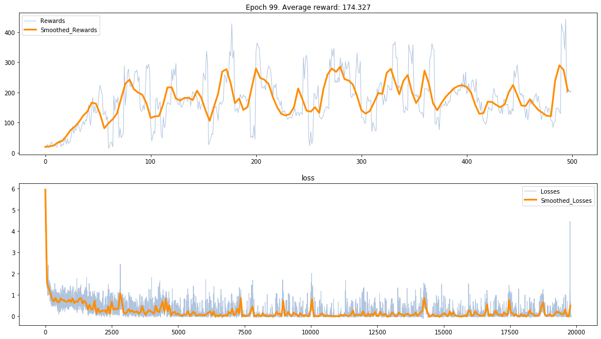
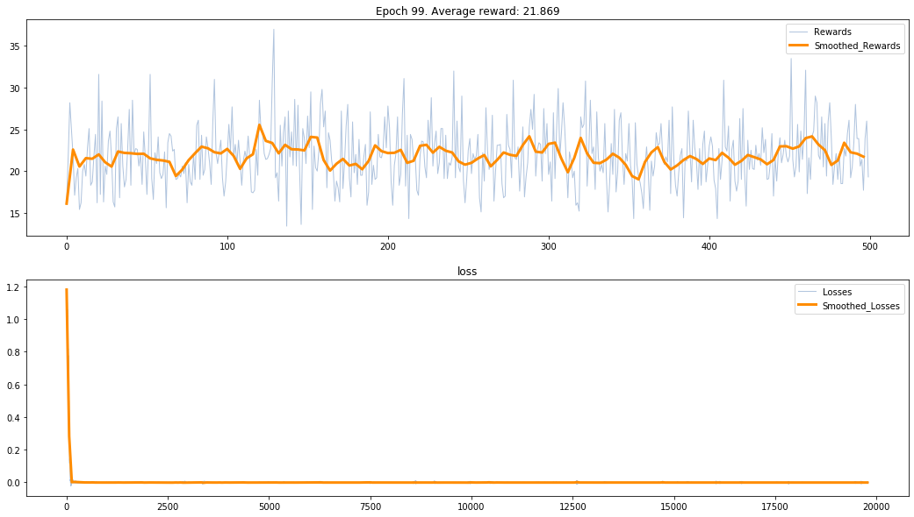

## 实现RL基本算法

**REINFORCE** 
**REINFORCE with baseline** 
**Q-learning** 
**DQN** 
**DoubleDQN** 
**DuelingDQN** 
**A2C** 
**DDPG** 
**PPO** 

## 算法复现的步骤:
1. 查看算法伪代码理解算法思路
2. 以伪代码为基础，结合网上博客的分析，得出自己的理解
3. 找两到三份书写正确，书写规范的代码供参考
4. 编码&&debug
5. 完善步骤2的理解
6. 查看论文

## Tag 1:
**应该是这样子的:  
在DPG之前很难(或者无法)做到连续动作空间的决策，因为为了exploration，使用的都是随机策略 。
而最早使用随机策略进行连续动作空间决策的是A3C， why?
**

## Tag 2:
**Actor_Critic计算TD_target的两种方式: 
1. 计算 $G_t$,直接 TD_target = $[G_t], t=1,2,3,\dots$(此时 $G_t$ 为TD_target的无偏估计)
    1. G_t 初始化为0
    2. G_t 初始化为next_state的value
    3. G_t 全为next_state的value
2. 计算下一个状态的value, TD_target = reward + gamma * model(next_state)
3. 具体选择哪个时看哪个的方差较小，再决定选择哪个
**
### 不同方法的效果(A2C)
**1.1:**
</img>
**1.2:**
</img>
**1.3:**
</img>
**2.:(无法收敛)**
</img>
### 总结:
这只是一个公式在实现上的差别，具体的可以打印出各自的方差再做出选择