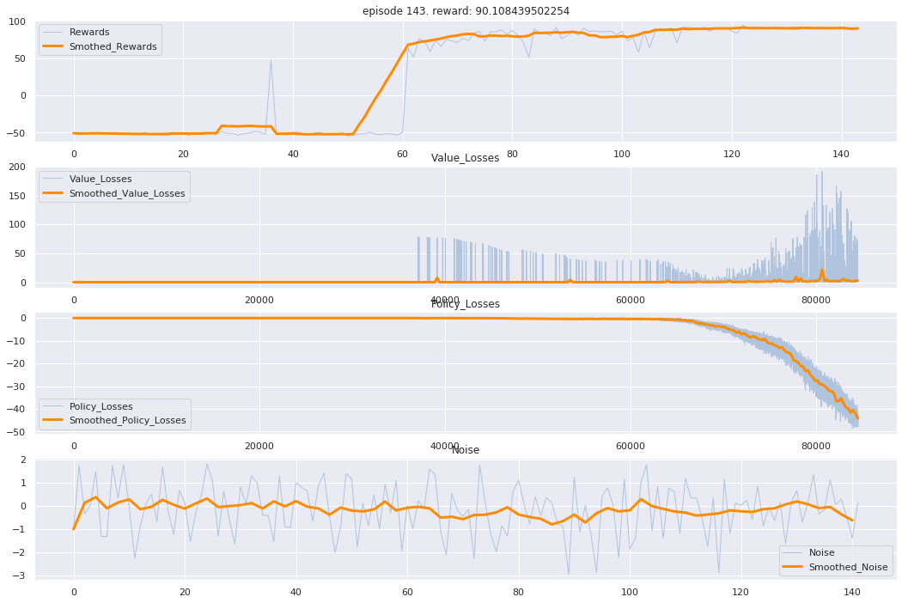

```Algorithm ``` : ```DDPG(确定性策略)```

```Environment``` : ```MountainCarContinuous-v0(连续动作控制，spare reward)```


### 1. 问题：方向噪声向量和普通高斯噪声对训练结果的影响

* 存在方向**噪声向量**：


* 使用普通**高斯噪声**：



​	两种噪声的生成方式分别进行5次训练和5次测试，绘图如下 : 


* 结论：

​	方向向量噪声：收敛速度更快，Average reward 较高，学习效果更好

​	高斯噪声：收敛速度较慢，Average reward较低，学习效果较差

### 2. 测试：

​	可控变量：方向噪声的持续时间，噪声的大小

​	方向噪声的持续时间(update_step)：50，100，150，200，250，300 (steps)

​	噪声大小：np.random.randn(1) * [0.1,  0.5, 1.0, 1.5, 2.0, 3.0]

### 3. 测试结果

方向噪声持续时间不变的情况下，噪声越大，reward越高

噪声大小不变的情况下，update_step越大，reward不一定越高

So，貌似只和noise大小有关，


One more thing:
    主要的噪声方式：ε-greedy, OU noise, parameter noise, novelty search from evolution strategies, "rollout" in many different horizon lengths, efficiently coordinate exploration