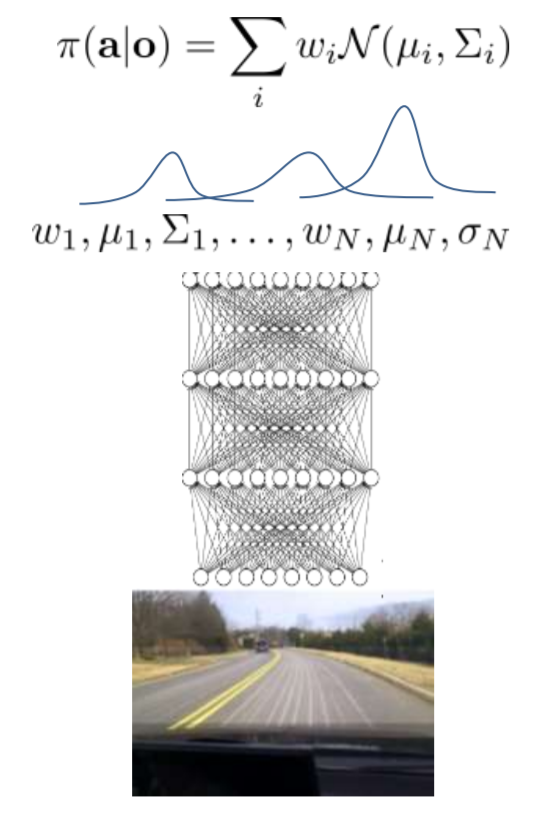

## 第二节 Imitation learning(模仿学习)：根据人类的经验和行为进行学习

1. 从 $o_t​$ 和 $a_t​$ 序列中通过监督学习，学到策略 $\pi_\theta(a_t,o_t)​$ ，也称为行为克隆(behavior cloning)

   问题是要如何去学到好的策略，agent会全盘照抄，序列中肯定有好的也有不好的 $ a_t $

2. DAgger : Dataset Aggregation(数据聚合)

   目标：从$P_{\pi_\theta(o_t)}​$ 收集数据，而不是 $p_{data}(o_t)​$ 

   运行 $\pi_\theta(a_t,o_t)​$

   需要标签(label) $a_t​$

   步骤：

   1. 从人类数据 $D=\{o_1,a_1,\dots,o_N,a_N\}​$ 训练出 $\pi_\theta(a_t,o_t)​$
   2. 运行 $\pi_\theta(a_t,o_t)$ 获取数据 $D_\pi=\{o_1,\dots,o_M\}$
   3. 人工标注 $D_\pi$ 的动作 $a_t$
   4. 聚合：$D \leftarrow D \cup D_\pi$ 。返回步骤一

   问题所在：非马尔科夫行为。人类会根据过去的经历来选择动作 $ a_t $

   解决：使用循环神经网络

   多模型行为：人类在同一个状态所选的 $a_t$ 会因心情不同而有所变化 

   解决：

   1. Output mixture of Gaussians，神经网络输出每个model的高斯分布

      

   2. Latent variable models(潜在可变模型)，在输入时添加噪声
   3. Autoregressive discretization(自动回归离散化)

3. 模仿学习的其他用途
   1. Structured prediction(结构预测) : 机器翻译时句子的结构
   2. Inverse(相反的) reinforcement learning
4. 问题所在
   1. 需要人类提供大量数据。当数据充足的情况下，深度学习更有效
   2. 人类无法提供某些动作，如无人机的电压...
   3. 人类能自我学习